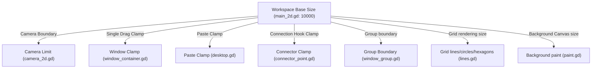

# Mod Target Analysis (対象機能の制御経路解析)

ノード配置の上限緩和（対象A）および配置可能領域の拡張（対象B）に関連するコード経路と依存関係の解析報告です。

---

## 1. Target A: Node Count Limit (ノード総数上限)

ゲーム内には「個別ウィンドウ（ノード）の上限」と「ワークスペース全体の配置上限」の2つの制限システムが併存しています。

### 1.1 制限定義の場所とパラメータ

1. **ウィンドウ種別ごとの個別上限**
   * **定義位置**: アップグレード、研究、パークなどのデータ管理クラス `Attributes` で動的制御。
   * **取得関数**: `scripts/attributes.gd` 内の `get_window_attribute(window, "limit")`。
   * **判定条件**: `scripts/utils.gd` の `can_add_window(window: String) -> bool`
     ```gdscript
     var limit: int = Attributes.get_window_attribute(window, "limit")
     var active: int = Globals.window_count[window]
     if limit >= 0 and active >= limit: return false
     ```

2. **ワークスペース全体の総ウィンドウ配置上限**
   * **定義位置**: `scripts/utils.gd` の定数定義
     ```gdscript
     const MAX_WINDOW: int = 500
     ```
   * **現在配置数**: `Globals.max_window_count`

### 1.2 制限検証の実行経路 (Enforcement Paths)

* **経路A1：個別ウィンドウ配置時のチェック**
  * **入口**: メニューからドラッグして配置を完了した瞬間。
  * **処理**: `scenes/window_dragger.gd` の `place()` メソッド。
    ```gdscript
    if Globals.max_window_count >= Utils.MAX_WINDOW:
        Signals.notify.emit("exclamation", "build_limit_reached")
        Sound.play("error")
    elif Utils.can_add_window(window):
        # 配置インスタンス生成
    ```
* **経路A2：スキーマ（コピペ）展開時のチェック**
  * **入口**: クリップボードまたは保存済みスキーマから一括配置した瞬間。
  * **処理**: `scripts/desktop.gd` の `paste(data: Dictionary)` メソッド。
    ```gdscript
    if required > Utils.MAX_WINDOW - Globals.max_window_count:
        Signals.notify.emit("exclamation", "build_limit_reached")
        Sound.play("error")
        return
    ```

### 1.3 UI表示と警告経路

* **個別上限の表示**: `scripts/windows_tab.gd` にて、ウィンドウ情報欄の現在数/上限数の形式でレンダリング。
  ```gdscript
  $WindowPanel/InfoContainer/InstanceContainer/Count.text = "%d/%.0f" % [
      Globals.window_count[cur_window], 
      Attributes.get_window_attribute(cur_window, "limit")
  ]
  ```
* **警告通知**: 上限到達時に `Signals.notify.emit("exclamation", "build_limit_reached")` がトリガーされ、画面中央にエラーバナーが表示されます。

---

## 2. Target B: Workspace Bounds (ノード配置可能領域)

配置領域は、基準サイズである `10000` (基準位置: `0`〜`10000`, 中心: `5000, 5000`) をハードコードしたクランプおよび描画ループが各部に散在しています。

### 2.1 座標クランプおよび検証の制御箇所

1. **個別ウィンドウのドラッグ移動**
   * **ファイル**: `scenes/windows/window_container.gd`
   * **メソッド**: `get_position_snapped(to: Vector2) -> Vector2`
   * **処理**: `to = to.clamp(Vector2.ZERO, (Vector2.ONE * 10000) - size).snappedf(50)`
2. **スキーマ貼り付け時のクランプ**
   * **ファイル**: `scripts/desktop.gd`
   * **メソッド**: `paste(data: Dictionary)`
   * **処理**: `var clamped_pos: Vector2 = target_pos.clamp(Vector2.ZERO, Vector2(Vector2(10000, 10000) - data.rect.size).max(Vector2.ZERO))`
3. **接続線のアンカー位置**
   * **ファイル**: `scenes/connector_point.gd`
   * **処理**: `var pos: Vector2 = to.clampf(0, 10000).snappedf(25)`
4. **グループ枠の制限**
   * **ファイル**: `scenes/windows/window_group.gd`
   * **定数**: `const MAX_BOUNDS = Vector2(10000, 10000)`

### 2.2 カメラおよび表示領域制御

1. **カメラ移動限界**
   * **ファイル**: `scripts/main_2d.gd` -> `set_screen(screen: int)`
   * **処理**: `camera.limit = screen_size[screen]` (スクリーン0であるDesktopの初期サイズ `screen_size[0]` は `10000`)。
2. **背景キャンバス領域**
   * **ファイル**: `scripts/paint.gd`
   * **処理**: `draw_rect(Rect2(Vector2(-5000, -5000), Vector2(10000, 10000)), Color.WHITE)`

### 2.3 グリッド・レンダリング依存 (scripts/lines.gd)

`10000` の大きさに合わせて、グリッド線や描画ノードをループ処理で生成しています。
* **格子グリッド (`build_lines`)**: 横縦200本 ($50 \times 200 = 10000$) で生成し、長さ `10000` で描画。
* **対角グリッド (`build_diagonal_lines`)**: 計算式 `count_factor: int = int((10000.0 * 2) / 50.0) + 10` を使用。
* **六角形グリッド (`build_hexagons`)**: `10000.0` の幅・高さに合わせて `rows`, `cols` を決定。
* **星空背景 (`build_starfield`)**: `rng.randf_range(0, Vector2(10000, 10000))` に星をランダム配置。

---

## 3. Bounds Dependency Map (境界依存関係図)


*(注意：これらの `10000` は独立して記述されているため、パッチ設計時は全箇所の参照元を漏れなく拡張サイズで上書きする必要があります。)*
