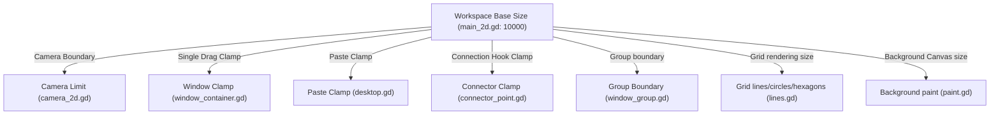

# Mod Target Analysis (対象機能の制御経路解析)

ノード配置の上限緩和（対象A）および配置可能領域の拡張（対象B）に関連するコード経路と依存関係の解析報告です。

---

## 1. Target A: Node Count Limit (ノード総数上限)

ゲーム内には「個別ウィンドウ（ノード）の上限」と「ワークスペース全体の配置上限」の2つの制限システムが併存しています。

### 1.1 制限定義の場所とパラメータ

1. **ウィンドウ種別ごとの個別上限**
   * **定義位置**: アップグレード、研究、パークなどのデータ管理クラス `Attributes` で動的制御。
   * **取得関数**: `scripts/attributes.gd` 内の `get_window_attribute(window, "limit")`。
   * **判定関数**: `scripts/utils.gd` の `can_add_window(window: String) -> bool`。
   * **重要な再確認結果**: `can_add_window()` は種別ごとの上限と属性コストを確認するが、ワークスペース全体の500個上限はここでは判定していない。

2. **ワークスペース全体の総ウィンドウ配置上限**
   * **定義位置**: `scripts/utils.gd` の `MAX_WINDOW` 定数。
   * **現在配置数**: `Globals.max_window_count`

### 1.2 制限検証の実行経路 (Enforcement Paths)

* **経路A1：Windows tab のクリック追加**
  * **入口**: ノードメニューから選択中ノードを追加する操作、またはデスクトップUIでノード項目を選択して追加する操作。
  * **処理**: `scripts/windows_tab.gd` の `_on_add_pressed()` および `_on_window_selected(window: String)`。
  * **重要性**: 実ゲーム検証で501個目が拒否された直接経路として最有力。旧Phase 2Aはこの経路をpatchしていなかった。
* **経路A2：ドラッグ配置**
  * **入口**: メニューからノードをドラッグして配置を完了する操作。
  * **処理**: `scenes/window_button.gd` がplacerを生成し、`scenes/window_dragger.gd` の `place()` が最終配置を実行する。
* **経路A3：スキーマ（コピペ）展開時のチェック**
  * **入口**: クリップボードまたは保存済みスキーマから一括配置した瞬間。
  * **処理**: `scripts/desktop.gd` の `paste(data: Dictionary)` メソッド。
* **経路A4：スキーマUIの事前可否表示**
  * **入口**: 保存済みスキーマを選択したときの必要ノード数表示。
  * **処理**: `scripts/schematics_tab.gd` の `update_node_count()`。
  * **注意**: 表示とボタン状態の制御であり、最終配置拒否は `desktop.gd` 側で発生する。

### 1.3 UI表示と警告経路

* **個別上限の表示**: `scripts/windows_tab.gd` にて、ウィンドウ情報欄の現在数/種別上限数の形式でレンダリング。
* **全体上限の表示**: `scripts/windows_tab.gd` のノード数ラベルはバニラ上限値を参照する。Phase 2A-R1では配置経路のみを対象とし、この表示修正は未実装。
* **警告通知**: 上限到達時に `Signals.notify.emit("exclamation", "build_limit_reached")` がトリガーされ、画面中央にエラーバナーが表示されます。
* **Phase 2A-R1の結論**: 501個目の拒否は、旧patchが対象にしていない `scripts/windows_tab.gd` 経路の500上限判定で説明できる。ドラッグ配置やペーストも別経路として残るため、R1はクリック追加経路の最小候補に限定する。

---

## 2. Target B: Workspace Bounds (ノード配置可能領域)

配置領域は、基準サイズである `10000` (基準位置: `0`〜`10000`, 中心: `5000, 5000`) をハードコードしたクランプおよび描画ループが各部に散在しています。

### 2.1 座標クランプおよび検証の制御箇所

1. **個別ウィンドウのドラッグ移動**
   * **ファイル**: `scenes/windows/window_container.gd`
   * **メソッド**: `get_position_snapped(to: Vector2) -> Vector2`
   * **処理**: バニラ領域内へ座標をクランプし、グリッド単位へ丸める。
2. **スキーマ貼り付け時のクランプ**
   * **ファイル**: `scripts/desktop.gd`
   * **メソッド**: `paste(data: Dictionary)`
   * **処理**: 貼り付け先をバニラ領域内にクランプする。
3. **接続線のアンカー位置**
   * **ファイル**: `scenes/connector_point.gd`
   * **処理**: 接続点座標をバニラ領域内にクランプする。
4. **グループ枠の制限**
   * **ファイル**: `scenes/windows/window_group.gd`
   * **処理**: グループ枠の最大境界にバニラ領域サイズを使用する。

### 2.2 カメラおよび表示領域制御

1. **カメラ移動限界**
   * **ファイル**: `scripts/main_2d.gd` -> `set_screen(screen: int)`
   * **処理**: スクリーン別サイズからカメラ制限を設定する。Desktopの初期サイズはバニラ領域サイズ。
2. **背景キャンバス領域**
   * **ファイル**: `scripts/paint.gd`
   * **処理**: バニラ領域サイズの背景矩形を描画する。

### 2.3 グリッド・レンダリング依存 (scripts/lines.gd)

`10000` の大きさに合わせて、グリッド線や描画ノードをループ処理で生成しています。
* **格子グリッド (`build_lines`)**: 横縦200本 ($50 \times 200 = 10000$) で生成し、長さ `10000` で描画。
* **対角グリッド (`build_diagonal_lines`)**: 計算式 `count_factor: int = int((10000.0 * 2) / 50.0) + 10` を使用。
* **六角形グリッド (`build_hexagons`)**: `10000.0` の幅・高さに合わせて `rows`, `cols` を決定。
* **星空背景 (`build_starfield`)**: `rng.randf_range(0, Vector2(10000, 10000))` に星をランダム配置。

---

## 3. Bounds Dependency Map (境界依存関係図)

*(注意：これらの `10000` は独立して記述されているため、パッチ設計時は全箇所の参照元を漏れなく拡張サイズで上書きする必要があります。)*
